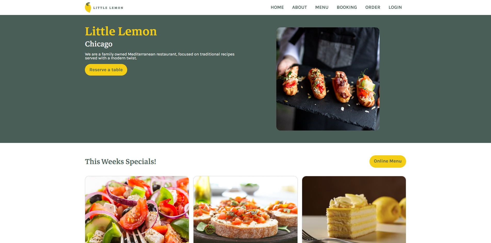

# Meta Front-End Developer Capstone Project

[Español](README-es.md)

## Little-Lemon Website 🍋

Welcome to the Little Lemon Website repository. This project was created as part of Meta's Front-End Development course on Coursera.



### Project Overview

The Little Lemon Website is a responsive and interactive website designed for a fictional restaurant called "Little Lemon". The website is built with modern web technologies including HTML, CSS, SCSS, JavaScript, React, and is based on designs created in Figma. It features a menu, booking form, and other components that allow users to interact with the restaurant's services.

With this project I test my knowledge by using React, figma wireframes, prototypes and system design, advance use of SCSS, testing, 404 pages, documentation, responsive design, accesibility and API consumption.

### Features

- **Responsive Design**: The website adapts to various screen sizes, providing a seamless experience on both desktop and mobile devices.
- **Interactive Booking Form**: Users can fill out a booking form to make reservations.
- **Menu Display**: A section showcasing the restaurant's menu with dynamic content.
- **Modern UI**: The website uses a clean, user-friendly design with an attractive color palette and typography.

### Technologies Used

- **HTML**: Structure and content of the website.
- **CSS**: Styling and layout of the website, including responsive design techniques.
- **SCSS**: Advanced CSS preprocessor used to enhance the styling with variables, nesting, and more maintainable code.
- **JavaScript**: Client-side functionality and interactivity.
- **React**: A JavaScript library for building user interfaces, used to create reusable components.
- **React-Bootstrap**: UI components for building responsive layouts.
- **Formik & Yup**: Form handling and validation for the booking form.
- **Figma**: Design tool used to create the wireframes and UI/UX design for the website.

### Getting Started

To run this project locally, follow these steps:

1. **Clone the repository:**

   ```bash
   git clone https://github.com/Daniel-Paez-Rojas/little-lemon-restaurant.git
2. **Run localy the website by**:

   ```bash
   npm run start
